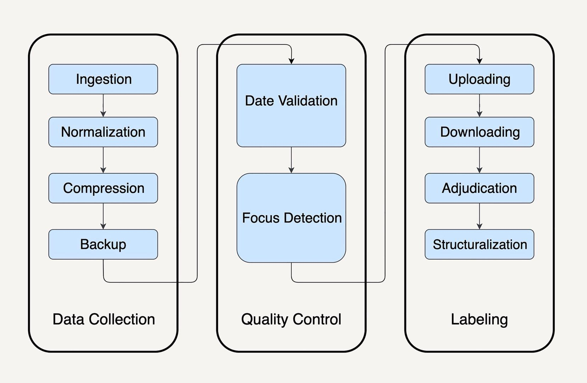

# Large-scale data processing framework

MapReduce已经被淘汰了 因为维护的成本相当高 而且泛化衍生的能力不强。MapReduce的一个局限是他为了批处理而设计的，应对流处理的时候不太行。

一个标准数据处理流程

我们理想的框架应该不需要复杂的配置 能够自动进行性能优化。对于框架的设计思路，我们要能把数据处理的描述语言，与背后的运行引擎解耦合开来。

大规模数据处理框架 基本模型应该是这样

分布式系统的服务等级协议 SLA 评估系统

SLA：Service-Level Agreement 服务等级协议，指的是系统服务提供者（Provider）对客户（Customer）的一个服务承诺。

1. 可用性（Availability）：可用性指的是系统服务能够正常运行所占的时间百分比。99.99% Availability可以被认为是高可用。
2. 准确性\(Accuracy\)：准确性指的是我们所设计的系统服务中，是否允许某些数据是不准确的或者是丢失了的。如果允许这种情况发生，用户可以接受的概率（百分比）是多少？一般系统架构会以错误率来定义这个标准。 $$错误率= \frac{导致系统产生内部错误的有效请求数}{期间的有效请求总数}$$ ， 一般我们可以采用性能测试（Performance Test）或者是查看系统日志（Log）两种方法来评估
3. 系统容量\(Capacity\)：系统容量通常指的是系统能够支持的预期负载量是多少，一般会以每秒的请求数为单位来表示。QPS（Queries Per Second）和RPS（Requests Per second）就是指系统每秒可以响应多少请求数。对于定义准确的QPS，可以有以下几种方法，一是使用限流（Throtting）的方法，定义每秒最多发送多少请求，二是在系统交付前进行系统测试。第三种，是分析系统在实际使用时产生的日志（Log）
4. 延迟（Latency）:延迟指的是系统在收到用户的请求到响应这个请求之间的时间间隔。一般系统的SLA会有p95或者是p99这样的延迟声明。这里的P指的是percentile，也就是百分位的意思。如果说一个系统的p95延迟是1秒的话，那就表示在100个请求里面有95个请求的响应时间会少于1秒，而剩下的5个请求响应时间会大于1秒。

当系统架构在不停迭代的时候，有了一个明确的SLA，我们可以知道下一代系统架构的改进目标以及优化好的系统架构是否比上一代的系统SLA更加优秀。

分布式的另外几个基础概念：

分布式的核心是可扩展性（Scalability），最基本而且最流行的增加系统容量的模型有两种，水平扩展\(Horizontal scaling\)和垂直扩展\(Vertical Scaling\)。水平扩展就是指在现有的系统中增加新的机器节点。垂直扩展就是在不改变系统中机器数量的情况下，“升级”现有机器的性能，比如增加机器的内存。

水平扩展的适用范围更广，操作起来简单并且会提升系统的可用性。但是无节制的增加机器数量会带来问题。比如机器的管理，调度，通信会变得更加复杂，出错的可能性会更高，更难保证数据的一致性等。与之相反，垂直扩展并没有让系统变得复杂，但是单个机器提升的性能是有限的，而且提高机器的性能比购买新的机器更加昂贵。

一致性：

可用性对于任何分布式系统都很重要，一般来说，构成分布式系统的机器节点的可用性要低于系统的可用性。为了保证系统中不同的机器节点在同一时间，接收到和输出的数据一致呢，就引入了一致性\(Consistency\)的概念。一致性在高可用性的系统里是非常核心的概念，常用的一致性模型：强一致性（Strong Consistency）, 弱一致性（Weak Consistency）和最终一致性（Eventual Consistency）。

强一致性：系统中的某个数据被成功更新后，后续任何对该数据的读取操作都将得到更新后的值。所以在任意时刻，同一系统所有节点中的数据是一样的

弱一致性：系统中的某个数据被更新后，后续对该数据的读取操作可能得到更新后的值，也可能是更改前的值。但经过“不一致时间窗口”这段时间后，后续对该数据的读取都是更新后的值。

最终一致性：是弱一致性的特殊形式。存储系统保证，在没有新的更新的条件下，最终所有的访问都是最后更新的值。

除了以上三个，分布式系统理论中还有很多一致性模型，如顺序一致性（Sequential Consistency），因果一致性（Casual Consistency）。在实际的应用系统中，强一致性是很难实现的，应用最广的是最终一致性。

持久性：

数据持久性（Data Durability）意味着数据一旦被成功存储就可以一直继续使用，即是系统中的节点下线，宕机或数据损坏也是如此。想要提高持久性，数据复制比较通用的做法。把同一份数据存储在不同的节点上。

还有一个持久性是消息持久性。消息持久性包含两个方面：1. 当消息服务的节点发生了错误，已经发送的消息仍然会在错误解决之后被处理。 2. 如果一个消息队列声明了持久性，那么即使队列在消息发送之后掉线，仍然会在重新上线之后收到这个消息。

批处理\(Batching Processing\)与流处理\(Streaming Processing\)

数据可以分成抽象成两种，无边界数据（Unbounded Data）和有边界数据（Bounded Data）

